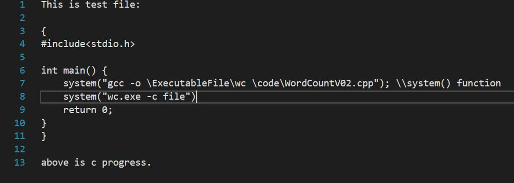
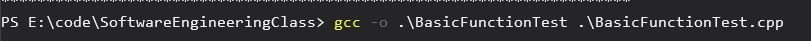
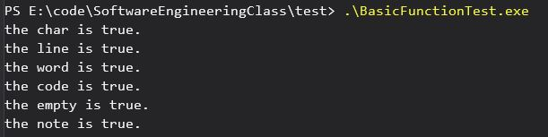
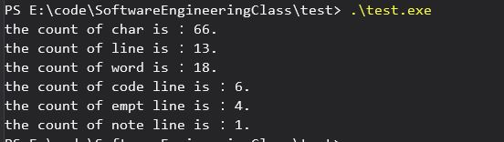

#项目简介

本项目是基于C语言实现的命令行文本技术统计程序。程序能够正确统计导入的纯英文TXT文本中字符数，单词数，句子数。实现该功能的源码为**\code\WordCountV01.cpp**，此为还可以统计文本中的代码行、空行、注释行。整个功能整合的源码为**\code\WordCountV02.cpp**

项目在最大程度上实现比较通用的功能，但本人的代码逻辑能力比较弱，所以要求英语纯文本要符合一下的几点条件：

1. 文本第一行不能为空行。
2. 文本到代码块要用“{}”标记起来。
 
3. 文本中的代码块所写的注释要跟在每一行的代码后面。

#程序使用方法

下面命令行中wc.exe为编译后的可执行文件，file.txt为纯英文文本。

```
wc.exe -c file.exe
```

统计文本的字符数。该字符数包括大小写字母，数字。

```
wc.exe -l file.exe
```

统计文本的总行数。

```
wc.exe -w file.exe
```

统计文本的单词数。

```
wc.exe -a file.exe
```

扩展功能的集成，即统计文本中的代码行、空行、注释行。注意事项看前面的项目简介

#程序的使用示例
本示例使用gcc编译器编译。



下面依次是统计文本的基本功能和扩展功能的示例。


#单元测试
单元测试是对程序的每个模块进行测试。由于我使用的是C语言编写代码，所以每个模块对应的是每个函数。由于我以前没有接触过单元测试，对于单元测试的集成框架不是很熟悉。所以我自己写了一个小程序作为单元测试。源码路径为 **test** 文件夹。测试的文档有66个字符，13行，18个单词，6行代码，4行空，1行注释。其中 **test.cpp** 实现的时命令行的测试，而 **BasicFunctionTest.cpp** 实现每个行数的测试：

**示例**

BasicFunctionTest.cpp


test.cpp

